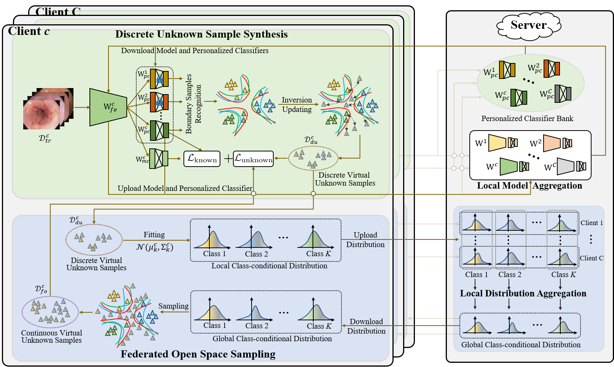

# FedOSS

Code for our paper: "FedOSS: Federated Open Set Recognition via Inter-client Discrepancy and Collaboration, TMI 2023."

Open set recognition (OSR) aims to accurately classify known diseases and recognize unseen diseases as the unknown class in medical scenarios. However, in existing OSR approaches, gathering data from distributed sites to construct large-scale centralized training datasets usually leads to high privacy and security risk, which could be alleviated elegantly via the popular cross-site training paradigm, federated learning (FL). To this end, we represent the first effort to formulate federated open set recognition (FedOSR), and meanwhile propose a novel Federated Open Set Synthesis (FedOSS) framework to address the core challenge of FedOSR: the unavailability of unknown samples for all anticipated clients during the training phase. The proposed FedOSS framework mainly leverages two modules, i.e., Discrete Unknown Sample Synthesis (DUSS) and Federated Open Space Sampling (FOSS), to generate virtual unknown samples for learning decision boundaries between known and unknown classes. Specifically, DUSS exploits inter-client knowledge inconsistency to recognize known samples near decision boundaries and then pushes them beyond decision boundaries to synthesize discrete virtual unknown samples. FOSS unites these generated unknown samples from different clients to estimate the class-conditional distributions of open data space near decision boundaries and further samples open data, thereby improving the diversity of virtual unknown samples. 

<div align=center>

</div>

## Running
### Dependencies
```
pip install -r requirements.txt
```
### Scripts
- [x] download [ResNet18](https://download.pytorch.org/models/resnet18-5c106cde.pth) model of PyTorch and put it into the dir './pre_model/'.
- [x] download [Blood Cell](https://zenodo.org/record/6496656/files/bloodmnist.npz?download=1) and [3D Organ](https://zenodo.org/record/6496656/files/organmnist3d.npz?download=1) datasets and put them into the dir './datasets/MedMNIST/'. For the HyperKvasir dataset, the processed version is avaliable via the [link](https://drive.google.com/file/d/1QOKXKwQh9wYVTWC1ckQnLF6LLpejpjXW/view?usp=sharing). Please unzip and put it into the dir './datasets/'.
- [x] pretrain the FedOSS framework on Blood Cell dataset.
```
python main.py \
    --data_root='./datasets/MedMNIST/bloodmnist.npz' \
    --lr=5e-4 \
    --backbone='Resnet18' \
    --dataset='Bloodmnist' \
    --known_class=5 \
    --unknown_class=3 \
    --seed=0 \
    --batchsize=8 \
    --epoches=100 \
    --client_num=16 \
    --worker_steps=1 \
    --mode='Pretrain' \
    --dirichlet=0.5 \
```
- [x] finetune the FedOSS framework on Blood Cell dataset.
```
python main.py \
    --data_root='./datasets/MedMNIST/bloodmnist.npz' \
    --lr=1e-4 \
    --backbone='Resnet18' \
    --dataset='Bloodmnist' \
    --known_class=5 \
    --unknown_class=3 \
    --seed=0 \
    --batchsize=8 \
    --epoches=30 \
    --client_num=16 \
    --worker_steps=1 \
    --mode='Finetune' \
    --eps=0.1 \
    --num_steps=1 \
    --unknown_weight=1. \
    --dirichlet=0.5 \
    --start_epoch='[5,10,15,20,25]'
    --sample_from=8 \
```
## Citation
```
@ARTICLE{10177875,
  author={Zhu, Meilu and Liao, Jing and Liu, Jun and Yuan, Yixuan},
  journal={IEEE Transactions on Medical Imaging}, 
  title={FedOSS: Federated Open Set Recognition via Inter-client Discrepancy and Collaboration}, 
  year={2023},
  doi={10.1109/TMI.2023.3294014}
}
```
      
